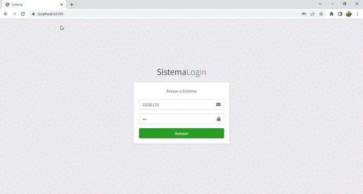

  <h1>S/Aplicação WEB ASP.NET Core</h1>

  

  

_________________

### Sobre
A aplicação permite realizar o cadastro e controle de clientes, funcionários, animais e atendimentos.
  
### Tecnologias
No desenvolvimento da aplicação foi utilizada a linguagem **C#**, a estrutura **ASP.NET Core MVC**, **AJAX** por meio da biblioteca **jQuery** e o banco de dados **MySQL**.
